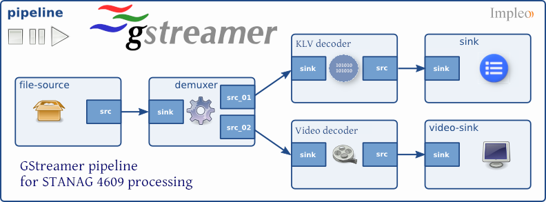

# gstreamer-klv-plugins-release

  

**GStreamer KLV plugins** - A set of KLV / MISB metadata plugins (encoder / decoder)

- klvdecode - MISB KLV decoder plugin  
- klvencode - MISB KLV encoder plugin  

More info on [GStreamer KLV plugins](https://www.impleotv.com/content/gstreamer-klv-plugins/help/index.html).

## System Requirements
OS: Windows x64 / Linux (x64, arm64).

## Installation

**Gstreamer klv plugins** can be downloaded as a **zip** file for the following operation systems:  
 - Gstreamer-klv-plugins-windows-x64.zip  - Windows
 - Gstreamer-klv-plugins-linux-x64.zip    - Linux x64
 - Gstreamer-klv-plugins-arm64.zip  - Linux arm64

## Download links

|          | Version             | Download link                                                           | 
|:---------|:-------------------:|:------------------------------------------------------------------------|
| **Gstreamer-klv-plugins linux-x64**     |   v1.0.0 | [gstreamer-klv-plugins-linux-x64.zip](https://github.com/impleotv/gstreamer-klv-plugins-release/releases/latest/download/gstreamer-klv-plugins-linux-x64.zip)   | 
| **Gstreamer-klv-plugins windows-x64**   |   v1.0.0 | N/A | 
| **Gstreamer-klv-plugins-arm64**   |   v1.0.0 | N/A | 

*Released on Fri, 30 Sept, 17:59 GMT+3*

## Plugin configuration

Before using the plugins you'll need to configure some paths/environmental variables.  

More info on [plugin configuration](https://www.impleotv.com/content/gstreamer-klv-plugins/help/user-guide/env-variables.html)

